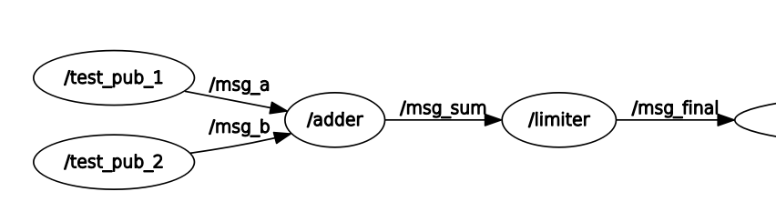

# Topic Connector

Connector nodes can be used to connect multiple ROS message topics. For example two torque control signals can be summed using a joint state adder node. A joint state switch node publishes a topic if it is published, otherwise selects the alternative topic. Limiter stops publishing if the published values are too high.

### Usage

An [example launch file](launch/connector_example.launch) to configure connector nodes is given.
It launches the following nodes, adding msg_a to msg_b and limiting their sum:

